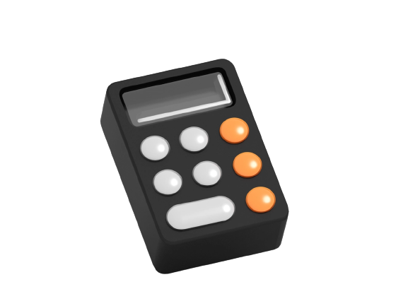
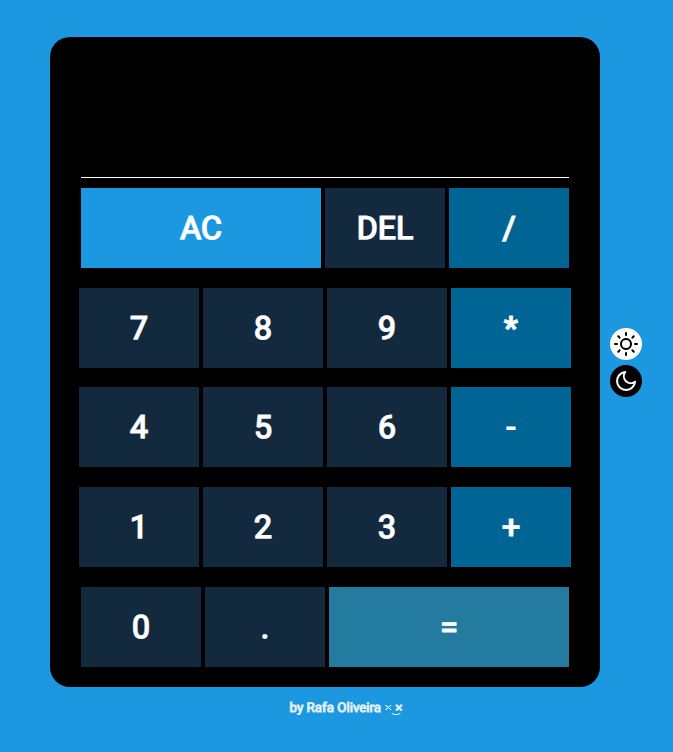
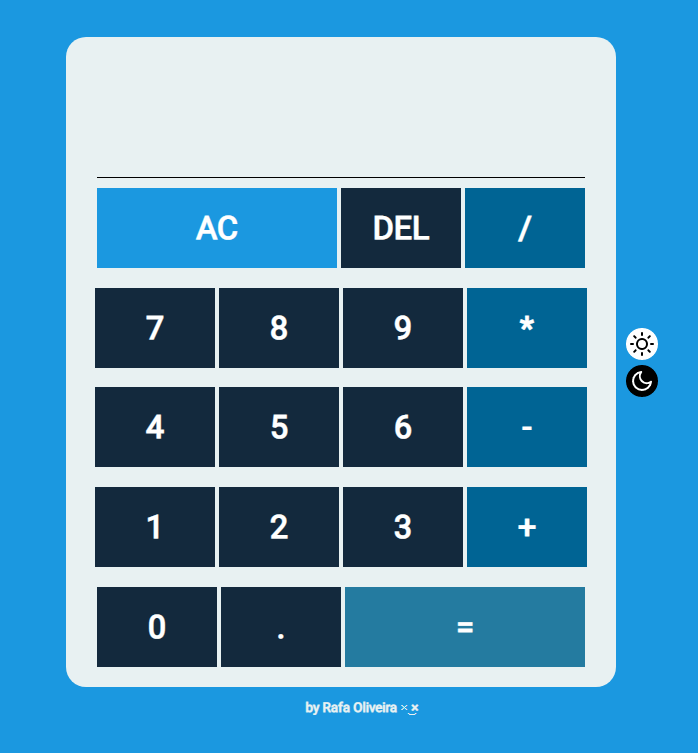

## **CALCULADORA JS**

### 📍 **SOBRE**
Calculadora simples desenvolvida com JavaScript. Nela é possivel realizar as seguintes operações:

* Adição
* Subtração
* Divisão
* Multiplicação

Além das seguintes funcionalidades
* Limpar
* Apagar

E tambem e possivel é possivel usar a calculadora na cor branca ou cor preta,opção disponivel em botões ao lado da calculadora

### ⚫ **DARK**

### ⚪ **LIGHT**

### 🚀 <a href="https://rafaoliveira22.github.io/calculadora-js/" target="_blank">**CLIQUE AQUI**</a> PARA VISUALIZAR O PROJETO